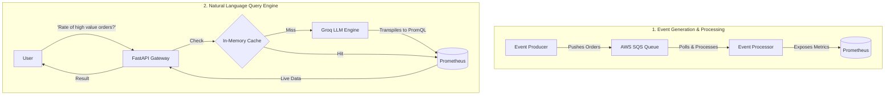

<div align="center">
  <h1> AI-Powered Observability Engine</h1>
  <p><b>"Google for System Metrics, but smarter."</b></p>
  
  [](https://python.org)
  [](https://fastapi.tiangolo.com)
  [](https://kubernetes.io/)
  [](https://prometheus.io/)
  [](https://github.com/features/actions)
  [](https://aws.amazon.com/)
</div>

---

##  The Problem it Solves (Real Use Case)
Normally, DevOps engineers and SREs have to write complex, error-prone PromQL queries to fetch live system data during high-stress incidents. 

**This system lets them just ask in English.** 

By wrapping a high-performance NLP-to-PromQL transpilation engine (powered by LLaMA3) around a real-time event processing backend, engineers can query their infrastructure as simply as using a search engine.

---

##  End-to-End Architecture

This is not a simple REST API. It is a full-stack, event-driven microservice ecosystem designed to production standards.



---

##  Key Engineering Features (Production Grade)

- **AI Translation Layer:** Uses Groq to dynamically transpile natural language into precise PromQL queries.
- **Bulletproof Resiliency:** 
  - **LLM Fallback:** If the LLM API rate-limits or fails, a local regex-based engine instantly takes over with zero downtime.
  - **Database Graceful Degradation:** If Prometheus is unreachable, the API intercepts the `ConnectionError` and returns a safe "System Offline" JSON response instead of a 500 server crash.
- **⚡ In-Memory Compiler Cache:** Redundant natural language queries bypass the LLM entirely, pulling the translated PromQL from RAM to drastically reduce latency and API costs.
- **☸️ Kubernetes Auto-Scaling (HPA):** If CPU utilization exceeds 60% during a traffic spike, the Horizontal Pod Autoscaler dynamically scales the API from 1 pod up to 5 pods to maintain low latency.
- **📈 Self-Monitoring API:** The system monitors itself. It exposes a `/metrics` endpoint tracking `ask_requests_total`, `cache_hits`, error rates, and query latency histograms.
- **🔄 Dual CI/CD Pipelines:** Fully automated build, test, and deployment pipelines written for both **Jenkins** and **GitHub Actions**.

---

##  The Tech Stack

| Technology | Role |
|------------|------|
| **Python / FastAPI** | High-performance, async backend framework. |
| **AWS SQS** | Decoupled message broker for the event-driven backend. |
| **Prometheus & Grafana** | Time-series database and visualization dashboards. |
| **Kubernetes (EKS)** | Orchestrates containers, manages state, and scales pods. |
| **Docker & ECR** | Containerization and secure image registry. |
| **Terraform** | Infrastructure as Code (IaC) to provision the AWS cloud. |
| **Jenkins / GH Actions** | Continuous Integration and Deployment (CI/CD). |

---

##  How to Run Locally (Docker Compose)

You can run the entire distributed system on your local machine with a single command. 

1. **Configure Environment:**
   Create a `.env` file in the root directory with your AWS credentials:
   ```env
   AWS_ACCESS_KEY_ID=your_key
   AWS_SECRET_ACCESS_KEY=your_secret
   AWS_REGION=ap-south-1
   SQS_QUEUE_URL=https://sqs.ap-south-1.amazonaws.com/...
   ```

2. **Boot the Infrastructure:**
   ```bash
   docker compose up -d --build
   ```
   *This starts the Producer, Processor, API, Prometheus, and Grafana simultaneously.*

3. **Ask a Question:**
   ```bash
   curl -X POST http://localhost:8080/ask \
        -H "Content-Type: application/json" \
        -d '{"question": "rate of high value orders over 5 minutes"}'
   ```

4. **Trigger the Load Test (Autoscaling Demo):**
   ```bash
   python load_test.py --requests 1000 --concurrency 50
   ```

---

##  Cloud Deployment (Kubernetes + Terraform)

To deploy to a live cloud environment:

1. **Provision Infrastructure:**
   ```bash
   cd terraform
   terraform init && terraform apply -auto-approve
   ```
2. **Deploy Microservices:**
   ```bash
   kubectl apply -k k8s/base/
   kubectl apply -f k8s/api/api_hpa.yaml
   ```

---

